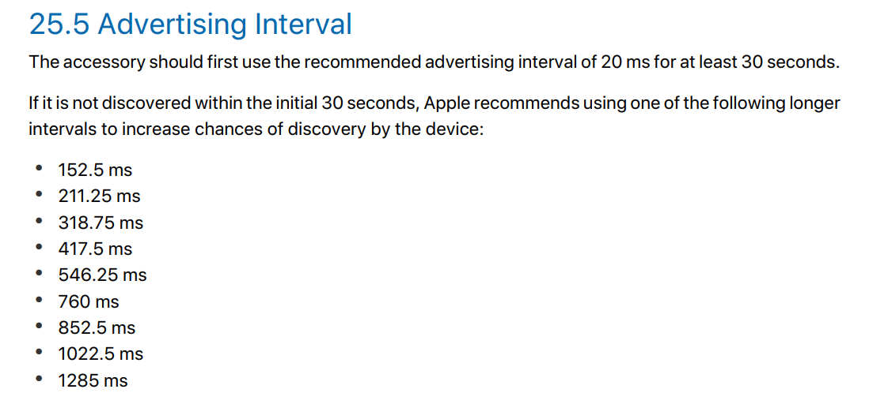

# hypnos

Module embedded inside users' laptop to "remind" them to take break and sleep

## Background

I used to have a script that runs every couple hours to turn the computer off to remind me to take a break. However, that script can be easily bypassed and it's not cross-platform. Embedding `hypnos` into the motherboard of my laptop and enabling tamperproof protection in the BIOS for the case make it much harder to bypass.

## Features

- Interact with device through phone app
  - Allow users' actions to be asynchronous, save and transmit their actions when the device is connected
  - Allow a limited number of exceptions through tokens per month: Allow users to select a time range that they don't want to be disturbed, the number of tokens needed are automatically calculated and applied
    - Waving sleep time as well as applying many tokens in the same day should cost more to prevent binge
  - Customizable work and break duration(there has to be an upper and lower limit though)
  - Limit amount of total screen time per day
  - Statistics for tracking progress
  - Foreground task to show device status as well as current phase
  - Synchronize with app to keep correct time, remind users to connect to device if they haven't for a long time
  - Indicate the current time stretch
  - Bed time and wake time
  - Battery indicator
- Flexibly adapt to user' start of day
- Hard to abuse or bypass but also possible to remove when truly necessary
- Low power consumption
- User has pending actions like changing rest interval
- Need corrective actions such as clock syncing
- Reset switch for resetting all settings(including BLE bonding information)
- Small size: About 1.5 x 1.5 inch

## Custom GATT

The custom service is called the `Timetable Service`. `Base and other UUIDs` are taken [here](https://github.com/NordicPlayground/nRF5x-custom-ble-service-tutorial):

```c
// base is f364adc9-b000-4042-ba50-05ca45bf8abc
#define UUID_SERVICE 0x1400
```

To store an hour:minute info, needs 11 bits(5 for hour, 6(least significant) for minute) for 24-hour format. All timing is stored that way except for the current time service.

All times are in GMT.

All would require authentication to read/write

| UUID   | Type                  | Data Type              | Range                           |
| ------ | --------------------- | ---------------------- | ------------------------------- |
| 0x1401 | MORNING_CURFEW_END    | time type              | 24-hour format                  |
| 0x1402 | NIGHT_CURFEW_START    | time type              | 24-hour format                  |
| 0x1403 | WORK_DURATION_MINUTE  | uint8                  | 30-120                          |
| 0x1404 | BREAK_DURATION_MINUTE | uint8                  | 5-15                            |
| 0x1405 | ACTIVE_EXCEPTIONS     | list of pair unix time | 0-4 exceptions                  |
| 0x1406 | TOKENS_LEFT           | uint8                  | depend on policy implementation |
| 0x1407 | CURRENT_UNIX_TIME     | uint32                 | until saturation                |

Max of 4 exceptions can be active at one time

## References

[BLE Chips Power Consumption](https://www.argenox.com/library/bluetooth-low-energy/bluetooth-le-chipset-guide-2019/#ble-device-comparison)
[Picking Advertising Interval](https://www.beaconzone.co.uk/ibeaconadvertisinginterval)

[Current Time Service](https://stackoverflow.com/questions/35695711/how-to-correctly-set-the-date-and-time-in-a-bluetooth-low-energy-peripheral)


