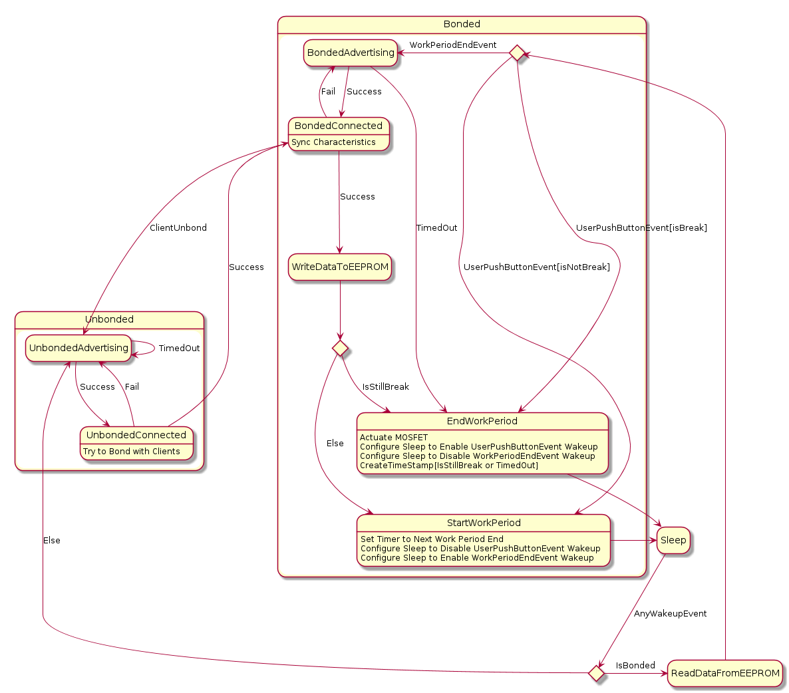

# Hypnos Firmware

## Dependencies

Make sure `nRF Command Line Tools`, `JLink Driver` and `nrfutil`(pip) are installed

## How to build the firmware

The project uses `CMake` as the build system. But first, you need to generate cmake files for the nrf52 sdk since they originally supported only makefiles, then you can build various targets that do things from building the firmware to flashing the board.

```shell
# assuming working directory is the project root

# generate cmake files for sdk
# shouldn't needed to be run too often
# there will be some warnings but that's okay
./generate_cmake_file_for_sdk.sh

mkdir -p build
cd build
rm -rf ./* # if previous build was for the tests, reset the state

cmake .. -DCMAKE_TOOLCHAIN_FILE=../nrf_sdk/toolchain.cmake
cmake --build . --target flash_pca10056 # build and flash pca10056 firmware
```

A faster way than using the commandline cmake is to use the vscode CMake extension, the project already contains a file describing the cmake `nrf52 kit` to be used for building, so select that kit during configuration and you should be good.

## How to build the tests

The project uses `doctest` as its unit test framework to test files that are not hardware-depdendent. The test cases themselves are included in the source files of the code being tested themselves. To build:

```shell
# assuming working directory is the project root

mkdir -p build
cd build
rm -rf ./* # if previous build was for the firmware, reset the state

cmake ..
cmake --build . # build and run all tests by default
```

## Power Consumption Data

NRF52840 power consumption data, measured using a trueRMS multimeter with supply voltage of 3V, assuming bonded device. At the longest adv interval, the device is still detected and connected pretty fast, although to the time connect is inconsistent.

| Type | Adv Interval(0.625 ms) | uA  |
| ---- | ---------------------- | --- |
| Slow | 50                     | 250 |
| Slow | 1000                   | 70  |
| Slow | 3000                   | 50  |
| Slow | 10000                  | 40  |

## State Machine

### Top Level



## References

The special event like BSP_EVENT_SYSOFF is assigned using:

```c
bsp_event_to_button_action_assign(BTN_ID_SLEEP,
                                  BSP_BUTTON_ACTION_LONG_PUSH,
                                  BSP_EVENT_SYSOFF);
```

[BSP Indication](https://infocenter.nordicsemi.com/index.jsp?topic=%2Fcom.nordic.infocenter.sdk5.v15.0.0%2Fgroup__bsp.html)
[BLE Security](https://duo.com/decipher/understanding-bluetooth-security)

[DCDC vs LDO power converter](https://devzone.nordicsemi.com/f/nordic-q-a/8106/internal-dcdc-vs-ldo-for-nrf52-series)

[Sending array in BLE data](https://devzone.nordicsemi.com/f/nordic-q-a/18040/ways-of-sending-a-float-array-as-a-value-of-a-characteristic)

[Software RTC](https://github.com/NordicPlayground/nrf5-calendar-example)
[Directed Advertising](https://devzone.nordicsemi.com/f/nordic-q-a/39950/directed-advertising---how-to-make-it-work)
[Power Optimization](https://www.argenox.com/library/bluetooth-low-energy/ble-advertising-primer/)
[CR2032 and NRF52](https://devzone.nordicsemi.com/f/nordic-q-a/36982/cr2032-coin-cell-battery-life-estimation-with-nrf52-as-beacon)
