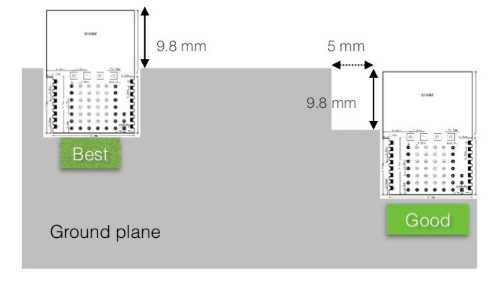
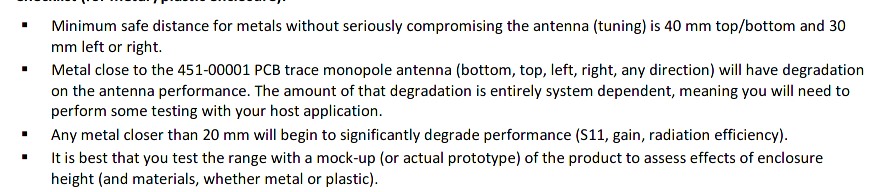

# PCB

## Constraints

Use the area of the spare network card. That area has nice cable management path from the side that has the off switch.

- Max Length: 32 mm inside flat area, 8 mm outside at the first 11 mm in width (not overlapping a lot of PCB just wires)
- Max Width: 30 mm inside flat area, 20 mm overlapping with MB PCB (Need 9.5 mm for BT840F)
- Max Height: 5 mm

[NRF52 Max Voltage for GPIO][1]

The antenna inside the T480s should be 50 ohm.

## BT840F PCB Layout Notes

2-sided PCB is sufficient.

## Notes

The bare right angle pin has height 2.5 mm

[1]: https://infocenter.nordicsemi.com/index.jsp?topic=%2Fcom.nordic.infocenter.nrf52832.ps.v1.1%2Fabs_max_ratings.html
